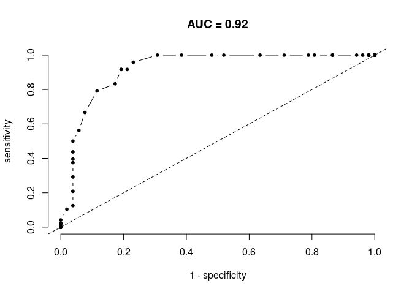
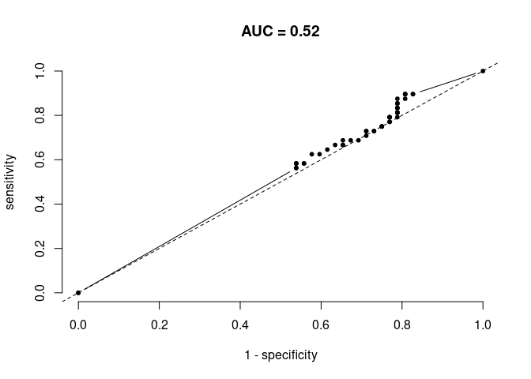

<!-- README.md is generated from README.Rmd. Please edit that file -->

# monkeytools

<!-- badges: start -->

[](https://github.com/emilio-berti/monkeytools/actions)
<!-- badges: end -->

The goal of monkeytools is to provide some utilities functions that I
use routinely. Every contribution is welcomed.

## Installation

You can install the development version of monkeytools from
[GitHub](https://github.com/emilio-berti/monkeytools) with:

``` r
devtools::install_github("emilio-berti/monkeytools")
```

monkeytools is not released on CRAN.

## Example

### Simple assessments of species distribution models.

Let’s first generate some data for a virtual species that never goes
above 130 meters.

``` r
library(monkeytools)
library(raster)
#> Loading required package: sp

data(volcano)
r <- raster(volcano)
xy <- xyFromCell(r, sample(1:ncell(r), 100))
x <- extract(r ,xy) #elevation
p <- ifelse(x < 130, 1, 0) #real presence/absence - doesn't like heights
occ <- data.frame(x = xy[, 1], y = xy[, 2], p = p) #combined in a dataframe
head(occ)
#>            x          y p
#> 1 0.64754098 0.18965517 1
#> 2 0.43442623 0.97126437 1
#> 3 0.33606557 0.90229885 1
#> 4 0.05737705 0.05172414 1
#> 5 0.28688525 0.23563218 0
#> 6 0.58196721 0.39655172 0

# sdm potential output
sdm <- 1 / r + rnorm(ncell(r), 0, .001) #sdm predictions
sdm <- sdm - sdm@data@min
sdm <- sdm / sdm@data@max
```

A very useful summary table is the *confusion matrix*. The confusion
table calculates the fraction of correctly predicted occurrences based
on observed data. For this, SDM output needs to be binarized.

``` r
sdm_bin <- sdm
sdm_bin[sdm < .5] <- 0
sdm_bin[sdm >= .5] <- 1
confusion(sdm_bin, occ)
#> $confusion.table
#>               obs.presence obs.absence
#> pred.presence           43           9
#> pred.absence             7          41
#> 
#> $specificity
#> [1] 0.8269231
#> 
#> $sensitivity
#> [1] 0.8541667
```

The confusion matrix is used in the famous **AUROC** curve, which shows
how much some statistics extracted from the confusion matrix change for
different binarization thresholds. The area under the AUROC curve
(**AUC**) measures how well the SDM fits data better than random (dashed
line). There are other (and better) summary statistics for
goodness-of-fit of SDMs, but AUC remains one the most adopted.

``` r
null <- AUROC(sdm, occ, th = seq(0, 1, length.out = 50))
```



And for a very bad SDM the two lines largely overlap.

``` r
values(sdm) <- rnorm(ncell(sdm))
null <- AUROC(sdm, occ, th = seq(0, 1, length.out = 50))
```



# Draw causal graphs

This is wrapper to `DiagrammeR` pacakge. It works only in HTML files.

``` r
dag_data <- data.frame(
  from = c("Rain", "Moisture", "Hair drier", "Rain"),
  to = c("Wet hair", "Wet hair", "Wet hair", "Moisture")
)
draw_dag(dag_data)
#> PhantomJS not found. You can install it with webshot::install_phantomjs(). If it is installed, please make sure the phantomjs executable can be found via the PATH variable.
```

<div id="htmlwidget-7cbb13f1e6ed480edf6d" style="width:100%;height:480px;" class="grViz html-widget"></div>
<script type="application/json" data-for="htmlwidget-7cbb13f1e6ed480edf6d">{"x":{"diagram":"digraph {\n graph []\n node [shape = plaintext]\n edge []\nRain -> Wet_hair \nMoisture -> Wet_hair \nHair_drier -> Wet_hair \nRain -> Moisture \n}","config":{"engine":"dot","options":null}},"evals":[],"jsHooks":[]}</script>
<!-- You'll still need to render `README.Rmd` regularly, to keep `README.md` up-to-date. `devtools::build_readme()` is handy for this. You could also use GitHub Actions to re-render `README.Rmd` every time you push. An example workflow can be found here: <https://github.com/r-lib/actions/tree/master/examples>. -->
<!-- You can also embed plots, for example: -->
<!-- ```{r pressure, echo = FALSE} -->
<!-- plot(pressure) -->
<!-- ``` -->
<!-- In that case, don't forget to commit and push the resulting figure files, so they display on GitHub and CRAN. -->
